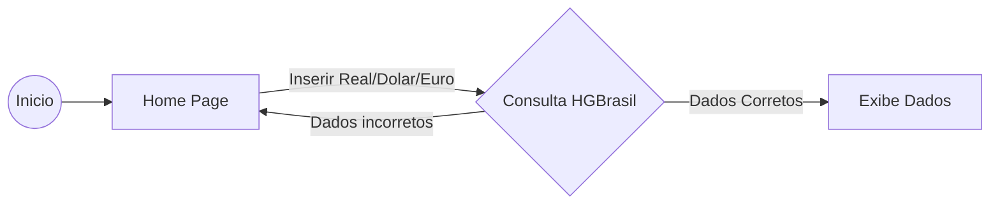

# Conversor de Moeda
Projeto de conversor de Moeda - Fatec 2023

## Requisitos:
<ol>
    <li>- [x] Criar uma aplicação Flutter​​​</li>
    <li>- [x] Utilizar HTTP do pub.dev​​</li>
    <li>- [x] Pegar dados das moedas na api HGBrasil​</li>
    <li>- [x] Calcular as conversões de valores ​</li>
</ol>

## Fluxograma:

### Minhas redes sociais, conecte-se comigo:

### Um pouco do meu GitHub:

